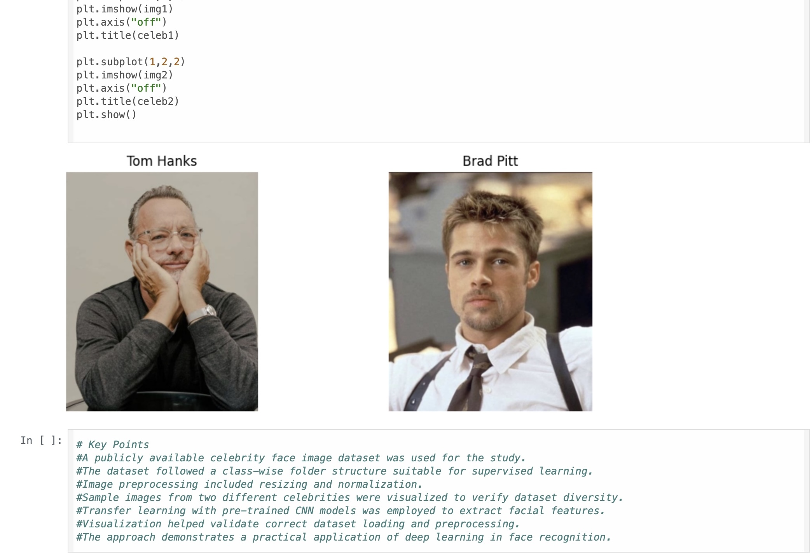
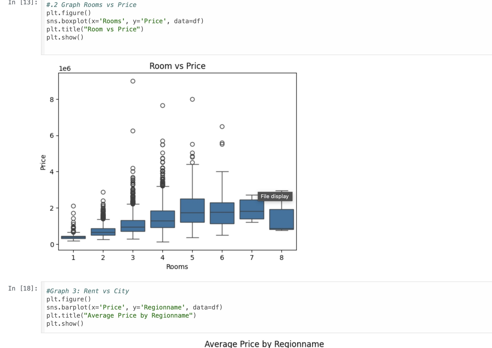
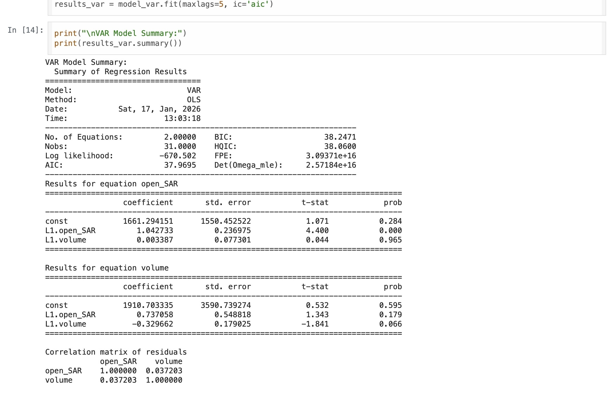

# ai-ml-projects

# Overview
This repository contains a collection of Artificial Intelligence and Machine Learning projects focused on real-world applications.

# Domains Covered
- Computer Vision  
- Deep Learning  
- Time Series Analysis  

# Technologies Used
- Python  
- NumPy  
- Pandas  
- Scikit-learn  
- TensorFlow / Keras  
- OpenCV  

# Projects
- Computer Vision Project (Image Processing / Detection)
- Deep Learning Project (Neural Networks)
- Time Series Project (Forecasting)

- 
- 
- 

# Objective
To build practical AI/ML solutions and gain hands-on experience in different domains.
